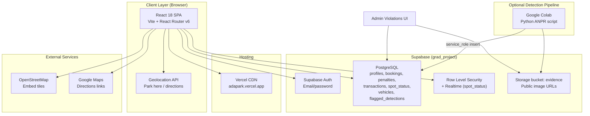
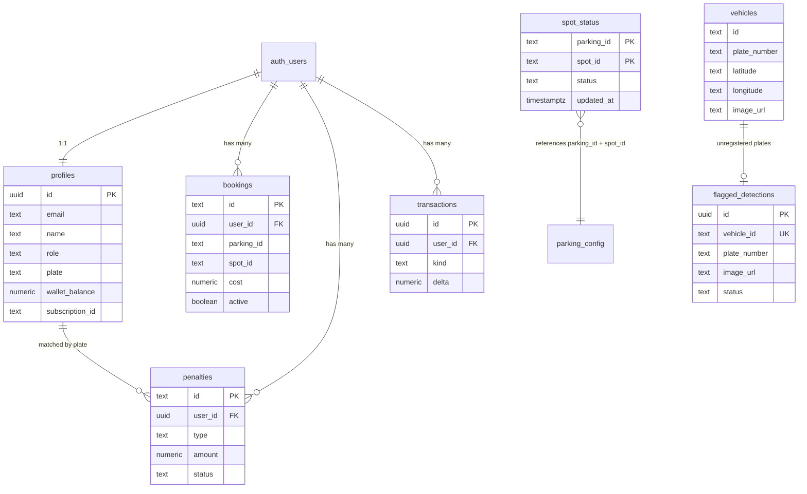

# Adapark — Smart Parking System  
**Final Project Report Content**  
*Graduation Project · Eastern Mediterranean University (EMU) Campus · Gazimağusa, KKTC*

---

## 1. Project Overview

### 1.1 Problem Statement

Parking at university campuses is often inefficient: drivers circle lots without knowing availability, operators lack a unified view of occupancy, and enforcement depends on manual checks. At EMU's Electrical & Electronic Engineering and Industrial Engineering departments, limited on-site parking creates friction for students, staff, and visitors—especially during peak hours.

### 1.2 Proposed Solution

**Adapark** (*ada* — "island" in Turkish + *park*) is a web-based smart parking platform scoped to **two EMU campus lots**:

| Lot ID | Name | Spots |
|--------|------|-------|
| `emu-electrical` | EMU Electrical Engineering Parking | 36 (6×6 grid) |
| `emu-industrial` | EMU Industrial Engineering Parking | 25 (U-shaped industrial layout) |

The system provides:

- **Driver-facing** tools: live lot maps, spot reservation, GPS-based "Park here," subscriptions, wallet, penalties, and booking history.
- **Admin-facing** tools: occupancy management, pricing configuration, user management, and violation handling with **evidence from an external detection pipeline** (Google Colab → Supabase).
- **Real-time occupancy sync** via Supabase `spot_status`, so admin spot changes propagate to all driver sessions within seconds.

### 1.3 Scope and Boundaries

- **In scope:** EMU campus (Gazimağusa), two configured garages, Supabase-backed persistence, responsive web UI, Vercel deployment.
- **Out of scope (current):** Native mobile app (planned via Capacitor), hardware ANPR cameras integrated directly into the web app, city-wide parking network beyond EMU.
- **Data architecture:** Static lot geometry lives in `parkingConfig.js`; dynamic occupancy lives in Supabase. Mock/in-memory data (`mockData.js`) has been **removed** in favour of real Supabase integration.

---

## 2. System Architecture

The system follows a **three-tier architecture**: React SPA (presentation), Supabase (backend-as-a-service), and an optional **Python/Colab detection pipeline** for plate evidence.



### 2.1 Component Responsibilities

| Layer | Component | Role |
|-------|-----------|------|
| Frontend | `AppContext.jsx` | Global state, auth, Supabase CRUD, spot sync (poll + Realtime) |
| Frontend | `parkingConfig.js` | Static lot definitions, GPS anchors, pricing tiers |
| Frontend | `RealLot.jsx` / `VirtualLot.jsx` | Coordinate-based vs grid-based lot rendering |
| Frontend | `geoUtils.js` | Lat/lng ↔ local metres, nearest-spot matching for GPS parking |
| Frontend | `RealMap.jsx` | OSM embed + parking pin overlays |
| Backend | `profiles.sql` | User profiles, roles, plate, wallet, RLS |
| Backend | `data_tables.sql` | Bookings, penalties, transactions |
| Backend | `parking_spots.sql` | Live `spot_status` table + public read / authenticated write |
| Backend | `plate_matching.sql` | `vehicles` feed, `flagged_detections`, evidence images |
| Pipeline | Colab script | Inserts detections + uploads evidence snapshots to Supabase Storage |

### 2.2 Request Flow Examples

**Spot booking:** Driver selects empty spot → `bookSpot()` updates local state + upserts `spot_status` → inserts `bookings` row → optional wallet debit via `transactions`.

**Admin spot cycle:** Admin taps spot in lot editor → `updateSpot()` → `persistSpotStatus()` upserts `spot_status` → Realtime/poll refreshes all clients.

**GPS Park here:** Browser Geolocation → `parkByLocation()` finds nearest lot (200 m threshold) → `isWithinLotBounds()` + `nearestSpot()` assign stall → auto-books via subscription or wallet.

---

## 3. Technology Stack

| Technology | Version | Purpose | Open Source | License |
|------------|---------|---------|-------------|---------|
| **React** | ^18.3.1 | UI component library | Yes | MIT |
| **React DOM** | ^18.3.1 | DOM rendering | Yes | MIT |
| **React Router DOM** | ^6.26.2 | Client-side routing, protected routes | Yes | MIT |
| **Vite** | ^5.4.10 | Dev server, production bundler | Yes | MIT |
| **@vitejs/plugin-react** | ^4.3.3 | Fast Refresh, JSX transform | Yes | MIT |
| **@supabase/supabase-js** | ^2.108.1 | Auth, PostgreSQL client, Realtime | Yes | MIT |
| **Lucide React** | ^0.456.0 | Icon set (Car, MapPin, Shield, etc.) | Yes | ISC |
| **Supabase (hosted)** | Cloud | PostgreSQL, Auth, RLS, Storage, Realtime | Platform (OSS core: Supabase) | Apache 2.0 (platform) |
| **PostgreSQL** | (via Supabase) | Relational database | Yes | PostgreSQL License |
| **Vercel** | Cloud | Static hosting, SPA rewrites | Proprietary hosting | N/A (service) |
| **OpenStreetMap** | — | Base map tiles (embed, no API key) | Yes | ODbL (data) |
| **Google Maps** | — | Turn-by-turn directions (external links only) | No | Proprietary |
| **Browser Geolocation API** | — | GPS for Park here | Web standard | N/A |
| **Google Colab** | — | Optional Python detection pipeline | Proprietary hosting | N/A |
| **Pure CSS / SVG charts** | — | `Charts.jsx` — no chart library | — | Project code |

*Note: `package.json` does not declare SPDX license fields; licenses above are the published defaults for each npm package.*

---

## 4. Features Implemented

### 4.1 Driver Features

- **Authentication:** Email/password sign-in and sign-up via Supabase Auth; role enforcement (driver vs admin); suspended-account blocking.
- **Profile & plate registration:** License plate captured at sign-up; mandatory plate gate before booking; editable vehicle info on Account page.
- **Live campus map (`/app`):** OpenStreetMap base with parking pins at real GPS coordinates; distance-sorted garage list; occupancy percentages and crowd levels.
- **GPS "Park here":** One-tap booking using device location; 200 m lot proximity check; U-shaped lot boundary validation; nearest empty stall assignment.
- **Google Maps directions:** Deep links from user location to nearest lot.
- **Parking detail & reservation (`/app/parking/:id`):** Interactive lot map (grid or real coordinate layout); spot picker; payment modal (subscription / card / wallet / Apple Pay UI).
- **Subscriptions (`/app/subscription`):** Four tiers (₺499.99–₺2,499.99/month); monthly/annual billing (20% annual discount).
- **Wallet (`/app/wallet`):** Balance, top-up, transaction history, Stars rewards.
- **Penalties (`/app/penalties`):** View unpaid/paid/disputed fees; pay from wallet; dispute flow; fee reference table.
- **History (`/app/history`):** Active and past bookings persisted in Supabase.
- **Mobile-responsive layout:** Breakpoints at 640px, 768px, 1024px in `global.css`; collapsible map grid on small screens.

### 4.2 Admin Features

- **Overview dashboard (`/admin`):** KPIs, revenue bar chart, hourly occupancy line chart, network donut — pure SVG/HTML charts (no external chart library).
- **Parking management (`/admin/parkings`):** Master table with rates, occupancy, crowd, revenue per garage.
- **Lot editor (`/admin/parkings/:id`):** Edit hourly rate and crowd state; **click spots to cycle** empty → filled → booked → blocked → empty; clear all spots; renders `RealLot` for industrial layout.
- **Violations (`/admin/violations`):** Penalty ledger from Supabase; manual issue-by-plate; **detected vehicles feed** from `vehicles` table; **flagged evidence** for unregistered plates with thumbnail images.
- **Pricing (`/admin/pricing`):** Network base rate, per-garage overrides, subscription tiers, penalty rules.
- **Users (`/admin/users`):** Driver directory; subscription tier, lifetime spend, penalty count; suspend/reactivate.

---

## 5. Database Design

All SQL migrations live in `app/supabase/` and are run in Supabase SQL Editor on project **`grad_project`**.

### 5.1 Entity Relationship Summary



### 5.2 Table Descriptions

| Table | Description | Key columns |
|-------|-------------|-------------|
| **`profiles`** | Extends `auth.users`; stores driver/admin role, plate, vehicle, subscription, wallet | `id`, `email`, `role`, `plate`, `wallet_balance`, `subscription_id`, `status` |
| **`bookings`** | Parking reservations | `id`, `user_id`, `parking_id`, `spot_id`, `hours`, `cost`, `starts_at`, `ends_at`, `active` |
| **`penalties`** | Violation fees | `id`, `user_id`, `type`, `amount`, `parking_id`, `status` (unpaid/paid/disputed) |
| **`transactions`** | Wallet ledger | `id`, `user_id`, `kind` (topup/park/penalty/reward), `delta` |
| **`spot_status`** | Live occupancy per spot | Composite PK `(parking_id, spot_id)`, `status` ∈ empty/filled/booked/mine/blocked |
| **`vehicles`** | External detection feed (Colab inserts via `service_role`) | `plate_number`, `detected_time`, `latitude`, `longitude`, `image_url` |
| **`flagged_detections`** | Unregistered plate evidence | `vehicle_id`, `plate_number`, `image_url`, `status` |

### 5.3 Security Model (RLS)

- **`profiles`:** Users read/update own row; admins read/update all.
- **`bookings`, `transactions`:** Owner full access; admins read all bookings.
- **`penalties`:** Owner read/update (pay/dispute); admins insert and manage.
- **`spot_status`:** **Public SELECT** (map availability); **authenticated users** can upsert (drivers and admins).
- **`vehicles`, `flagged_detections`:** Admin read/write only.
- **`is_admin()`** SQL function gates admin policies.

---

## 6. Deployment

### 6.1 Vercel (Production)

- **URL:** `https://adapark.vercel.app` (referenced in README)
- **Build:** `npm run build` (Vite → static `dist/`)
- **SPA routing:** `vercel.json` rewrites all paths to `index.html`:

```json
{ "rewrites": [{ "source": "/(.*)", "destination": "/index.html" }] }
```

### 6.2 Environment Variables

| Variable | Required | Description |
|----------|----------|-------------|
| `VITE_SUPABASE_URL` | Yes | Supabase project URL, e.g. `https://<ref>.supabase.co` |
| `VITE_SUPABASE_ANON_KEY` | Yes | Supabase anon/public API key |

- Set in **Vercel → Project → Settings → Environment Variables** for production.
- Locally: copy `app/.env.example` → `app/.env` and restart `npm run dev`.
- Vite exposes only `VITE_*` prefixed vars to the client bundle.
- `supabase.js` validates configuration and surfaces a login-page error banner if vars are missing.

### 6.3 Supabase Configuration

1. Run SQL files in order: `profiles.sql` → `data_tables.sql` → `parking_spots.sql` → `plate_matching.sql`
2. **Authentication → URL Configuration:** add production and `http://localhost:5173/**` redirect URLs.
3. **Realtime:** enable `spot_status` in Database → Publications → `supabase_realtime`.
4. **Storage:** create public `evidence` bucket for Colab image uploads.

### 6.4 Local Development

```bash
cd app
npm install
cp .env.example .env   # paste Supabase URL + anon key
npm run dev            # http://localhost:5173
```

---

## 7. Open Source & Third-Party Components

### 7.1 Direct npm Dependencies (All Open Source)

| Package | License | Use in Adapark |
|---------|---------|----------------|
| react, react-dom | MIT | UI framework |
| react-router-dom | MIT | Routing, protected layouts |
| vite, @vitejs/plugin-react | MIT | Build tooling |
| @supabase/supabase-js | MIT | Backend client |
| lucide-react | ISC | Icons |

### 7.2 Backend & Infrastructure

| Component | Type | Notes |
|-----------|------|-------|
| Supabase | BaaS (open-source core) | Auth, Postgres, RLS, Realtime, Storage |
| PostgreSQL | OSS database | Hosted by Supabase |
| Vercel | Proprietary PaaS | Static hosting only |

### 7.3 External APIs & Services (No SDK)

| Service | Integration | License / Terms |
|---------|-------------|-----------------|
| OpenStreetMap | iframe embed in `RealMap.jsx` | ODbL; no API key |
| Google Maps | URL links for directions | Google Maps Platform ToS |
| Browser Geolocation | `navigator.geolocation` | W3C standard |
| Google Colab | External Python pipeline | Google Terms; uses Supabase `service_role` |

### 7.4 Project-Original Code

- Lot layouts (`parkingConfig.js`), coordinate transforms (`geoUtils.js`), SVG charts (`Charts.jsx`), design tokens (`tokens.css`, `global.css`) — authored for this project.
- No charting library, no map SDK, no UI component framework (custom CSS).

---

## 8. Screenshots for Report (Figures)

*Capture code in your IDE for implementation figures; capture the running app at the listed routes for UI figures.*

---

**Figure 1 — Live Spot Status Synchronisation Architecture**  
*Caption:* Real-time parking occupancy synchronisation using Supabase polling (3 s interval) and Postgres Realtime subscriptions.

| | |
|---|---|
| **File** | `app/src/context/AppContext.jsx` |
| **Lines** | 166–202 |
| **Demonstrates** | `refreshSpots()` fetch, 3-second poll, Realtime channel on `spot_status`, `applySpotRows()` merge into local lot state |

---

**Figure 2 — Spot Status Persistence and Upsert**  
*Caption:* Authenticated upsert of individual spot status changes with error handling and project-ref diagnostics.

| | |
|---|---|
| **File** | `app/src/context/AppContext.jsx` |
| **Lines** | 295–327 |
| **Demonstrates** | `persistSpotStatus()` — session check, Supabase upsert, RLS failure messaging |

---

**Figure 3 — U-Shaped Industrial Lot Configuration**  
*Caption:* Coordinate-based parking layout for EMU Industrial Engineering lot, modelled from satellite imagery with 25 stalls in south, east, middle, and north rows.

| | |
|---|---|
| **File** | `app/src/data/parkingConfig.js` |
| **Lines** | 91–141 |
| **Demonstrates** | `buildIndustrialLot()` — metre-based spot centres (`cx`, `cy`), bounds, disabled/standard types |

---

**Figure 4 — EMU Campus Lot Definitions and GPS Anchors**  
*Caption:* Static configuration for two EMU garages with real-world latitude/longitude coordinates.

| | |
|---|---|
| **File** | `app/src/data/parkingConfig.js` |
| **Lines** | 162–193 |
| **Demonstrates** | `PARKINGS` array — Electrical (6×6) and Industrial (real shape) lot metadata |

---

**Figure 5 — GPS "Park Here" Geolocation Logic**  
*Caption:* Haversine nearest-lot detection, 200 m proximity threshold, lot-boundary validation, and nearest empty stall assignment.

| | |
|---|---|
| **File** | `app/src/context/AppContext.jsx` |
| **Lines** | 471–544 |
| **Demonstrates** | `parkByLocation()` — full GPS booking pipeline |

---

**Figure 6 — Coordinate Transform Utilities for Real Lots**  
*Caption:* Conversion between GPS coordinates and local lot metres for per-spot proximity matching.

| | |
|---|---|
| **File** | `app/src/lib/geoUtils.js` |
| **Lines** | 38–104 |
| **Demonstrates** | `latLngToLocal()`, `nearestSpot()`, `nearestEmptySpot()`, `isWithinLotBounds()` |

---

**Figure 7 — Supabase Client Configuration**  
*Caption:* Environment-driven Supabase initialisation with configuration validation for local and Vercel deployments.

| | |
|---|---|
| **File** | `app/src/supabase.js` |
| **Lines** | 1–22 |
| **Demonstrates** | `VITE_SUPABASE_URL`, `VITE_SUPABASE_ANON_KEY`, `isSupabaseConfigured`, project ref extraction |

---

**Figure 8 — Authentication and Role-Based Access**  
*Caption:* Driver/Admin role switch, plate capture at sign-up, and Supabase configuration error banner.

| | |
|---|---|
| **File** | `app/src/pages/Login.jsx` |
| **Lines** | 139–214 |
| **Demonstrates** | Sign-in/sign-up tabs, Driver/Admin role switch, plate field, env-var error alert |
| **UI route** | `/login` |

---

**Figure 9 — Real Coordinate Lot Renderer**  
*Caption:* SVG/CSS rendering of industrial lot with driving aisle, entry/exit, and status-coloured stalls.

| | |
|---|---|
| **File** | `app/src/components/RealLot.jsx` |
| **Lines** | 26–62 |
| **Demonstrates** | Percentage positioning from metre coordinates, car top-view on occupied spots |
| **UI route** | `/app/parking/emu-industrial` or `/admin/parkings/emu-industrial` |

---

**Figure 10 — Driver Map with GPS and "Park Here"**  
*Caption:* OpenStreetMap campus view with live user location, nearest lot banner, and one-tap GPS parking.

| | |
|---|---|
| **File** | `app/src/pages/user/UserMap.jsx` |
| **Lines** | 137–186 |
| **Demonstrates** | Park here button, `RealMap` integration, geolocation watch, directions links |
| **UI route** | `/app` (signed in as driver) |

---

**Figure 11 — OpenStreetMap Integration**  
*Caption:* Key-free campus map using OSM embed with custom parking pin overlays aligned to bounding-box projection.

| | |
|---|---|
| **File** | `app/src/components/RealMap.jsx` |
| **Lines** | 12–79 |
| **Demonstrates** | OSM iframe URL construction, zoom/pan, user marker, Google Maps fallback link |

---

**Figure 12 — Admin Violations and Evidence Pipeline**  
*Caption:* Plate detection feed cross-referenced against registered profiles; unregistered plates flagged with snapshot evidence from Colab.

| | |
|---|---|
| **File** | `app/src/pages/admin/AdminViolations.jsx` |
| **Lines** | 27–78 (detection matching) and 167–222 (evidence table) |
| **Demonstrates** | `vehicles` → `flagged_detections` upsert, evidence thumbnails from Supabase Storage |
| **UI route** | `/admin/violations` |

---

**Figure 13 (Bonus) — Spot Status RLS Policies**  
*Caption:* PostgreSQL Row Level Security enabling public read and authenticated write for live occupancy.

| | |
|---|---|
| **File** | `app/supabase/parking_spots.sql` |
| **Lines** | 6–38 |
| **Demonstrates** | `spot_status` schema, grants, public SELECT policy, authenticated ALL policy |

---

**Figure 14 (Bonus) — Admin Lot Editor Spot Cycling**  
*Caption:* Operator interface for cycling spot states and clearing entire lot occupancy.

| | |
|---|---|
| **File** | `app/src/pages/admin/AdminParkingEdit.jsx` |
| **Lines** | 28–31, 70–80 |
| **Demonstrates** | `cycleSpot()` state machine, clear-all-spots control |
| **UI route** | `/admin/parkings/emu-industrial` |

---

## 9. Challenges & Solutions

### 9.1 Live Spot Synchronisation Between Admin and Drivers

**Challenge:** Early versions kept occupancy in browser memory; admin changes did not appear on driver maps, and refresh lost all state.

**Solution:**
- Created Supabase `spot_status` table with composite primary key `(parking_id, spot_id)`.
- Implemented `persistSpotStatus()` upsert on every spot change.
- Added **3-second polling** plus **Postgres Realtime** subscription in `AppContext.jsx`.
- Configured RLS: public read, authenticated write; enabled `spot_status` in Supabase Realtime publication.
- Documented requirement to run full `parking_spots.sql` if saves return empty.

### 9.2 Environment Variable Configuration (Local vs Vercel)

**Challenge:** Missing or mismatched Supabase credentials caused silent sign-in failures; Vite requires `VITE_` prefix; local `.env` must match the Supabase project where SQL was executed.

**Solution:**
- Centralised config in `supabase.js` with `isSupabaseConfigured` flag.
- Login page displays explicit error banner when vars are absent.
- `.env.example` documents exact variable names; README instructs copying from Supabase Dashboard → Settings → API.
- Error toasts include `supabaseProjectRef` to debug project mismatches.

### 9.3 Mobile Responsiveness

**Challenge:** Map + sidebar layout and data tables overflow on phone screens.

**Solution:**
- CSS media queries in `global.css` at 640px, 768px, 1024px breakpoints.
- `map-grid` stacks vertically on narrow viewports.
- `data-table-wrap` enables horizontal scroll for admin tables.
- Touch-friendly pill buttons and large "Park here" CTA on map page.

### 9.4 Evidence Pipeline for Unregistered Plates

**Challenge:** ANPR detections from Colab must be matched against registered driver plates and store visual evidence for enforcement.

**Solution:**
- Colab script inserts into `vehicles` using Supabase **service_role** key.
- Evidence images uploaded to public **`evidence`** Storage bucket.
- `AdminViolations.jsx` normalises plates (`normPlate()` strips non-alphanumeric), compares against `profiles.plate`, upserts unregistered rows into `flagged_detections`.
- Admin UI renders thumbnail links to evidence URLs.

### 9.5 Mock Data Removal and Real Backend Migration

**Challenge:** Prototype relied on `mockData.js` with no persistence across sessions.

**Solution:** Deleted mock module; all user data (profiles, bookings, penalties, transactions, spot status) now flows through Supabase with RLS. Static lot geometry remains in `parkingConfig.js` by design (layout does not change at runtime).

### 9.6 GPS Accuracy for Per-Spot Assignment

**Challenge:** Consumer GPS (±5–15 m) cannot reliably distinguish adjacent stalls in a dense U-shaped lot.

**Solution (interim):** `nearestSpot()` / `nearestEmptySpot()` assign closest stall by local coordinate distance; `isWithinLotBounds()` rejects users outside the lot polygon. **Future work:** per-spot GPS calibration (Section 10).

---

## 10. Future Work

| Priority | Enhancement | Rationale |
|----------|-------------|-----------|
| High | **Capacitor mobile app** | Wrap the React SPA for iOS/Android; native geolocation and push notifications for booking expiry and penalties |
| High | **Per-spot GPS calibration** | Record ground-truth lat/lng at each stall centre on-site; improve `nearestSpot()` accuracy beyond generic layout coordinates |
| Medium | **Lot heading refinement** | Add `heading` property to industrial lot anchor for rotation-aware GPS transforms (`geoUtils.js` already supports `parking.heading`) |
| Medium | **Automated penalty issuance** | Rule engine linking `vehicles` detections to `penalties` when overstay/no-booking detected |
| Medium | **Pricing persistence** | Store admin pricing edits in Supabase instead of in-memory `AppContext` state |
| Low | **OAuth providers** | Google/Apple sign-in via Supabase Auth |
| Low | **Additional EMU lots** | Extend `parkingConfig.js` with more campus garages |
| Low | **Native map SDK** | Replace OSM iframe with MapLibre GL for smoother pan/zoom and offline tiles |

---

## Appendix A — Application Route Map

| Role | Path | Page |
|------|------|------|
| Public | `/login` | Authentication |
| Driver | `/app` | Campus map |
| Driver | `/app/parking/:id` | Lot detail & booking |
| Driver | `/app/subscription` | Subscription plans |
| Driver | `/app/wallet` | Wallet & transactions |
| Driver | `/app/penalties` | Penalties & disputes |
| Driver | `/app/history` | Booking history |
| Driver | `/app/account` | Profile & vehicle |
| Admin | `/admin` | Overview dashboard |
| Admin | `/admin/parkings` | Garage list |
| Admin | `/admin/parkings/:id` | Lot editor |
| Admin | `/admin/violations` | Violations & evidence |
| Admin | `/admin/pricing` | Pricing configuration |
| Admin | `/admin/users` | User management |

## Appendix B — Pricing Model (As Implemented)

- **Pay-as-you-go:** ₺50/hour baseline (per-garage override supported)
- **Subscriptions:** Commuter ₺499.99 · Pro Driver ₺899.99 · Fleet ₺1,599.99 · Platinum ₺2,499.99 per month
- **Annual billing:** ~20% discount vs monthly
- **Penalty types:** Overstay, wrong spot, no booking, blocking, expired documents — configurable base fees in `PENALTY_RULES`

## Appendix C — Source Tree (Key Paths)

```
app/
├── package.json
├── vercel.json
├── .env.example
├── README.md
├── supabase/
│   ├── profiles.sql
│   ├── data_tables.sql
│   ├── parking_spots.sql
│   └── plate_matching.sql
└── src/
    ├── main.jsx
    ├── App.jsx
    ├── supabase.js
    ├── context/AppContext.jsx
    ├── data/parkingConfig.js
    ├── lib/geoUtils.js, profileUtils.js, formatters.js, parkingStats.js
    ├── components/RealLot.jsx, RealMap.jsx, VirtualLot.jsx, Charts.jsx, …
    └── pages/
        ├── Login.jsx
        ├── user/   (UserMap, ParkingDetail, Wallet, …)
        └── admin/  (AdminOverview, AdminParkingEdit, AdminViolations, …)
```

---

*This document was synthesised from the Adapark codebase (`adapark-main/app`) as of the current project state. Replace placeholder URLs, add your own UI screenshots at the listed routes, and insert your name, supervisor, and submission date in your final submission.*
